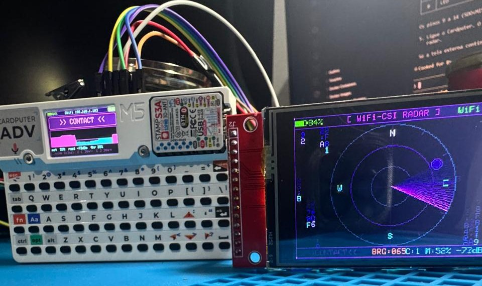
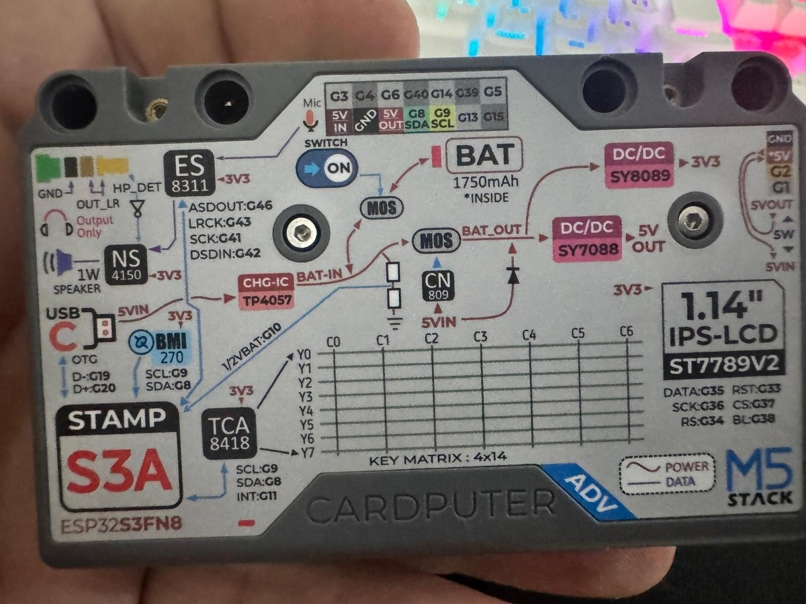
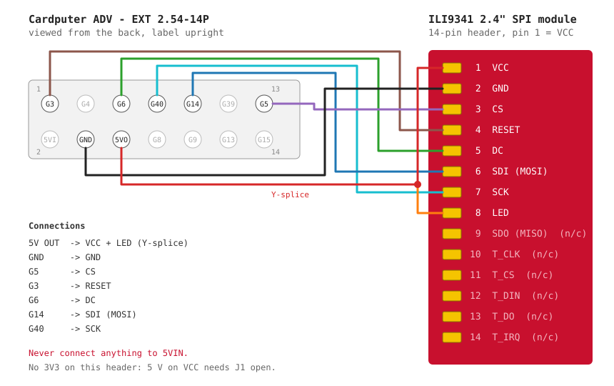
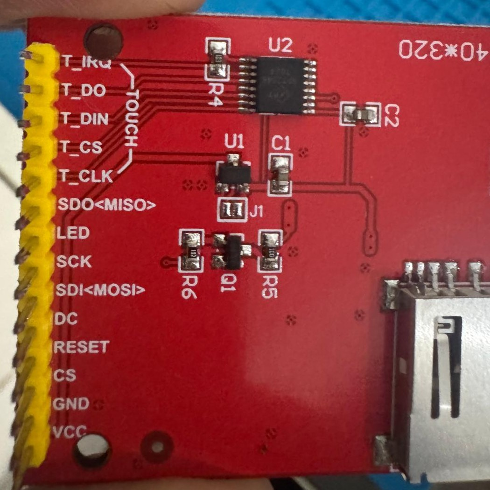
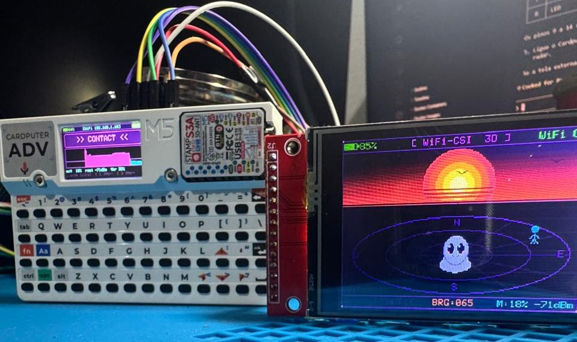

# Cardputer ADV WiFi CSI Human Detector

A build log and technical write-up of a WiFi presence detector running on the
M5Stack **Cardputer ADV**. It reads **Channel State Information (CSI)** from the
WiFi frames the ESP32-S3 receives, turns the variation in that signal into a
motion score, and shows the result on two screens at once: the Cardputer's own
display and an external 2.4" ILI9341 used as a radar scope.



*The finished build: status and motion graph on the Cardputer, radar scope on the external ILI9341.*

> **Credits.** The firmware is the work of **TalkingSasquach**
> ([skizzophrenic/Cardputer-CSI-Human-Detector](https://github.com/skizzophrenic/Cardputer-CSI-Human-Detector)),
> released under the MIT License. This repository starts from the upstream
> **v1.2.0** source (release tag `28c9502`). On top of it I added the hardware
> documentation for my setup, the wiring for this display module, the install
> path through M5Launcher, an explanation of how the detection and the scope
> work, and a few firmware fixes: in the on-device CSI build the calibrate and
> threshold keys did nothing, and the motion graph hid everything below the
> threshold (see [Changes from upstream](#changes-from-upstream)).

---

## Hardware

| Part | Details |
|------|---------|
| Console | M5Stack Cardputer ADV: StampS3A (ESP32-S3FN8), 8 MB flash, no PSRAM |
| External display | 2.4" TFT SPI module, ILI9341, 240×320 (red board, 14-pin header) |
| Extras on the display board | XPT2046 touch controller and microSD slot, both unused here |
| Wiring | 8 male-to-female jumpers (the display has male pins, the Cardputer header is female) |

The firmware's panel driver says "2.8 inch", but anything ILI9341 at 240×320
works the same way. The 2.4" module was used for this build.

---

## Wiring

The external display connects to the Cardputer ADV's **EXT 2.54-14P** header.
The pin map is printed on the back of the device; the photo below is the
reference I wired from.



Read with the label upright, the header is two rows of seven:

| | 1st | 2nd | 3rd | 4th | 5th | 6th | 7th |
|---|---|---|---|---|---|---|---|
| **Top row** (odd pins) | G3 | G4 | G6 | G40 | G14 | G39 | G5 |
| **Bottom row** (even pins) | 5VIN | GND | 5VOUT | G8 | G9 | G13 | G15 |

This matches the official pin map in the
[M5Stack documentation](https://docs.m5stack.com/en/core/Cardputer-Adv).



### Display → Cardputer ADV

In the order the pins appear on the display header:

| # | Display pin | Cardputer ADV | Header position |
|:-:|---|---|---|
| 1 | VCC | 5VOUT | bottom row, 3rd |
| 2 | GND | GND | bottom row, 2nd |
| 3 | CS | G5 | top row, 7th |
| 4 | RESET | G3 | top row, 1st |
| 5 | DC | G6 | top row, 3rd |
| 6 | SDI (MOSI) | G14 | top row, 5th |
| 7 | SCK | G40 | top row, 4th |
| 8 | LED | 5VOUT (shared with VCC) | bottom row, 3rd |
| 9–14 | SDO (MISO), T_CLK, T_CS, T_DIN, T_DO, T_IRQ | not connected | |

These pins are fixed in the firmware (`include/ext_panel.h`), so the
pre-built binary only works with this exact mapping.

### Power: there is no 3V3 on the header

The EXT header only offers **5VIN**, **5VOUT** and **GND**. Feeding the display
from 5 V is safe only because of how this module is built:



- **U1** is a 3.3 V regulator and the **J1** pads are open (not bridged). With
  J1 open, VCC goes through the regulator, so 5 V on VCC is fine. If J1 were
  bridged, the module would expect 3.3 V and 5 V would damage it.
- **LED** does not power the backlight directly. It drives transistor **Q1**
  through R5/R6, so it draws almost nothing and can share the 5VOUT pin with
  VCC. I joined both with a Y-splice (one male end, two female ends, soldered
  and heat-shrunk).
- **5VOUT** comes from the SY7088 boost converter fed by the battery, so the
  display stays powered when the Cardputer runs unplugged.
- The data lines are 3.3 V from the ESP32-S3, which the ILI9341 accepts as-is.
- **5VIN** is a power *input* to the Cardputer. Nothing goes there.

### The display shares the SD card bus

G40 (SCK), G14 (MOSI) and G39 (MISO) are also the microSD lines. The firmware
puts the display on the same SPI host as the SD card (`SPI2_HOST`,
`bus_shared = true`) and uses separate chip-select pins (G5 for the display,
G12 for the SD), so both coexist.

---

## Installing the firmware

The [releases page](https://github.com/IAforIA/cardputerADV-CSI-Human-detector/releases)
has a single merged image (bootloader + partition table + app) built from this
repository, meant to be written at offset `0x0`. The original firmware, without
the fixes described below, is in the
[upstream releases](https://github.com/skizzophrenic/Cardputer-CSI-Human-Detector/releases).
Two ways to get it onto the device:

### Option A: browser flasher (replaces everything on the flash)

1. Download the `.bin` from the
   [latest release](https://github.com/IAforIA/cardputerADV-CSI-Human-detector/releases/latest).
2. Connect the Cardputer over USB-C and open
   [esptool.spacehuhn.com](https://esptool.spacehuhn.com/) in Chrome or Edge.
3. **Connect**, choose the port, set the address to `0x0`, select the file,
   **Program**.
4. If the port does not show up, unplug, hold **G0** while plugging back in to
   enter download mode, and try again.

This erases whatever was on the device before (launchers, other firmware).

### Option B: M5Launcher from the SD card (what I used)

My Cardputer already runs M5Launcher with other tools installed, so I kept
it and installed the radar as one more app:

1. Copy the `.bin` to the SD card, into `/downloads/`.
2. On the Cardputer: **SD → downloads → the .bin → Install**.
3. After it reboots, power off, connect the display, power on.

**Lesson learned:** copy the file with a **card reader**, not with
M5Launcher's USB mass-storage mode. In my setup the USB mode listed the card
fine but disconnected in the middle of every write, leaving a truncated file
and a dirty FAT32 volume (`chkdsk /f` cleaned it up). Through a USB card
reader the copy worked the first time, verified by SHA-256.

### First boot

The firmware scans for networks, lets you pick one with the keyboard and asks
for the password. The credentials are stored in NVS (`Preferences`), so this
only happens once. A different network can be chosen later from the settings
menu.

A **white screen** on the external display before the firmware runs is
normal: the module has power and backlight, but no one has initialized the
ILI9341 yet.

---

## Using it

| Key | Action |
|-----|--------|
| `.` | Switch the external display between the radar scope and the 3D view |
| `` ` `` | Open / save-and-close the settings menu |
| `,` and `/` | Lower / raise the presence threshold (5 % to 95 %, saved across reboots) |
| `c` | Calibrate: re-learn the empty room for 5 seconds |

Inside the settings menu: `;` and `.` move between items, `,` and `/` change
the value, `` ` `` saves. The menu holds the colour palette, the brightness of
each screen and the WiFi network.



*The 3D view. The ghost in the middle is the device itself; the figure on the
right is the motion contact, at the same bearing (`BRG:065`) shown on the scope.*

---

## How it works

Everything below comes from reading `src/main.cpp`.

### 1. Capturing CSI

After connecting to WiFi, the firmware enables the ESP32's CSI capture
(`esp_wifi_set_csi`) with LLTF/HT-LTF enabled. For every received frame
the WiFi driver calls `csiCallback()` with the channel response: one complex
value (real, imaginary) per subcarrier.

### 2. From CSI to a motion score

For each frame the callback computes two numbers:

- the **mean amplitude** across subcarriers, `sqrt(re² + im²)`;
- the **mean sin(phase)**, `im / amp`, which reacts to smaller and slower
  movements than amplitude does.

Both go into a **50-frame sliding window**, and the variance of each window
is the raw signal. A still room gives low variance; someone moving between the
device and the access point changes the reflections and the variance jumps.

The variances are normalized to 0–1 against an adaptive floor and peak. The
floor drops quickly and rises slowly, and the peak decays slowly, so the
scale keeps adjusting to the room on its own. The two normalized values are
blended **60 % amplitude + 40 % phase** into the motion score.

### 3. Presence

`serviceCsi()` samples that score at about **15 Hz**:

- above the **threshold** (default 0.15, adjustable with `,` and `/`) →
  presence is set and a 10-second hold starts;
- below it, presence stays on while the hold counts down, with the motion
  value fading toward 10 % of its last peak;
- when the hold runs out, the status returns to CLEAR.

The hold is what keeps a person who stopped moving on screen for a while
instead of dropping them immediately.

### 4. What the radar scope shows

The scope looks like a real radar, but with a single antenna there is no
direction information. The code is explicit about it
(*"Single-sensor CSI has no directional data"*). How a contact is drawn:

- **Distance from the centre** comes from the **RSSI** of the access point:
  around −45 dBm sits near the centre, −78 dBm or weaker at the edge.
- **Bearing is random.** `pickBlipAngle()` picks an angle with `random()`,
  only avoiding the 6 and 12 o'clock positions so contacts don't overlap the
  avatar in the 3D view.
- **A new contact** is created when presence is on and the RSSI ring has moved
  more than 20 % of the scope radius away from every existing contact (at most
  one new contact every 800 ms, up to 12 at a time). Otherwise the closest
  contact is refreshed.
- **Each contact lasts 15 seconds** after its last refresh.

In practice: the scope says *"there is motion, and the signal to the access
point is this strong"*. It does not count people or locate them. When I
walked around the house holding the device, the changing RSSI kept creating
new contacts at random angles, which looked like extra people appearing. With
the device standing still on a desk it showed a single steady contact.

### 5. Camera sniffer

While CSI runs, the WiFi interface is also in promiscuous mode. Every
management and data frame's source MAC is compared against a list of 20 vendor
prefixes (OUIs): Ring, Wyze, Blink, Arlo, Hikvision, Reolink, Amazon, plus
generic Espressif and Realtek prefixes. A match puts a camera icon on the
scope and in the 3D view, positioned by RSSI, for 60 seconds after the last
frame. Because generic ESP32 prefixes are on the list, smart plugs and other
ESP-based gadgets will show up as "cameras" too.

### 6. Rendering

The built-in screen redraws at about 30 fps and the external one at about
8 fps. The external display renders into a 240×180 sprite that is scaled to
fill 320×240, because there is no PSRAM for a full-resolution framebuffer.

---

## Changes from upstream

The upstream firmware was written first for an external sensor that talked to
the Cardputer over UART, and later moved to on-device CSI. Two keys were left
wired to the old link:

- **`c` (calibrate) did nothing.** It sent a `CAL` command through
  `RadarLink::send()`, which returns early when no UART was opened, and the
  on-device build never opens one.
- **`,` and `/` did not change detection.** They moved the line on the graph,
  but `serviceCsi()` compared the motion score against a fixed `0.15`.
- **The graph was flat below the threshold.** When there was no presence,
  `serviceCsi()` reported a motion of `0`, so the graph only showed bars
  once detection had already triggered. With a saved threshold this became
  visible: after a reboot at a high threshold the device sat on CLEAR with an
  empty graph, which looked like it was not measuring at all.

What I changed in `src/main.cpp`:

- `serviceCsi()` now uses `gThreshold`, so the keys change the actual
  sensitivity. The default stays at 0.15, so out of the box it behaves like
  upstream. The value is stored in NVS with the other settings.
- `c` starts a 5-second calibration. The CSI callback resets its sliding
  windows and adaptive floor/peak, and presence stays off while they re-learn
  the room. The status pill shows **CAL** during this time. The reset is done
  inside the callback through a flag, because the callback runs in the WiFi
  task and the buffers should not be cleared from the main loop mid-frame.
- When there is no presence, the raw motion score is passed through, so the
  graph always shows the room's activity: blue under the threshold line, pink
  above it. That makes it possible to set the line just above the noise.
- The UART and fake-data builds keep their original behaviour.

## Practical notes

- **Moving the device invalidates everything.** The whole method measures
  changes in the channel between the device and the access point. Carrying it
  around changes that channel more than any person in the room does. For
  meaningful readings, leave it still and let the room do the moving.
- **Position matters.** Detection is strongest when people move through the
  path between the Cardputer and the access point.
- **Signal strength matters too.** The firmware gives the saved network 10
  seconds to connect before opening the network picker, and CSI is measured
  on every frame received from the access point. With a router far away the
  join is slow and few frames arrive, so the graph barely moves. A phone or
  PC hotspot a few metres away worked much better in my tests; some traffic
  on that hotspot (a video playing on another device) gives a steadier
  reading.

---

## Build from source

Requires [PlatformIO](https://platformio.org/).

```sh
pio run -e cardputer-radar-csi -t upload
```

Build configuration (from `platformio.ini`): `espressif32@6.12.0`, board
`m5stack-stamps3`, Arduino framework, custom 8 MB partition table,
`M5Unified` + `M5Cardputer`. `ARDUINO_USB_CDC_ON_BOOT=1` makes `Serial` the
USB-C port.

Pushing a `v*` tag runs `.github/workflows/release.yml`, which builds the
firmware and attaches a merged `0x0` image to a GitHub release.

---

## Repository layout

| Path | What it is |
|------|------------|
| `src/main.cpp` | Firmware: CSI capture, presence logic, both screens, keyboard, settings |
| `include/ext_panel.h` | ILI9341 driver config (pins, SPI host, rotation) |
| `include/radar_link.h` | Frame parser, state and 240-sample motion history |
| `platformio.ini`, `partitions.csv` | Build configuration |
| `docs/images/` | Photos and wiring diagram |

---

## Responsible use

WiFi passes through walls, so this kind of sensing works on people who don't
know it is happening. I built it to understand the technique as part of my
cybersecurity studies. Use it on your own network and in your own space.

---

## License

MIT, same as the upstream project. See [LICENSE](LICENSE). The original
copyright notice for the firmware is kept as required.
